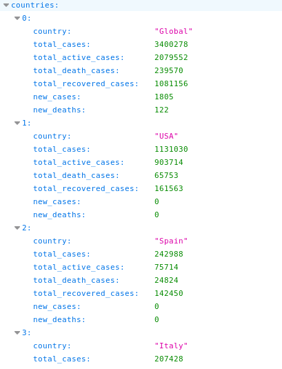
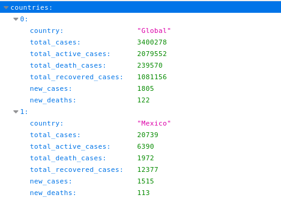

# README

COVID-19 Coronavirus Pandemic
Reported Cases and Deaths by Country.

COVID19 - API

GET https://covid20-info.herokuapp.com/api/v1/countries -> all countries info

GET https://covid20-info.herokuapp.com/api/v1/countries/CountryName -> country specific information

Things you may want to cover:

* Ruby version: ruby '2.5.1'

* Dependencies: sidekiq, redis -> bundle install

* Install redis and run in port 6379

* Database creation and Database initialization: rails db:setup

* Services (job queues): run -> sidekiq -q default

* The coronavirus COVID-19 is affecting 210 countries around the world.
* The day is reset after midnight GMT+0.
* The list of countries and territories and their continental regional classification is based on the United Nations Geoscheme.
* Learn more about Worldometer's COVID-19 data.